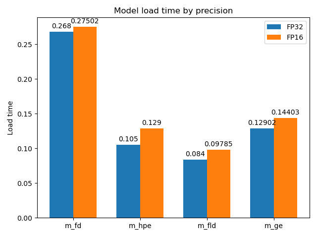

# Computer Pointer Controller

## Overview
Computer Pointer Controller uses the Gaze Estimation model to estimate the gaze of the user's eyes and change the mouse pointer position accordingly.The workflow is achieved by running
multiple models and coordinating the flow of data between those models.

The project relies on the following auxiliary networks from openvino pretrained models to accomplish mouse pointer position movement,

* Face Detection model - [Face Detection](https://docs.openvinotoolkit.org/latest/omz_models_intel_face_detection_adas_binary_0001_description_face_detection_adas_binary_0001.html)
* Head Pose Estimation model - [Head Pose Estimation](https://docs.openvinotoolkit.org/latest/omz_models_intel_head_pose_estimation_adas_0001_description_head_pose_estimation_adas_0001.html)
* Facial Landmarks Detection model - [Facial Landmarks](https://docs.openvinotoolkit.org/latest/omz_models_intel_landmarks_regression_retail_0009_description_landmarks_regression_retail_0009.html)
* Gaze Estimation Model - [Gaze Estimation](https://docs.openvinotoolkit.org/latest/omz_models_intel_gaze_estimation_adas_0002_description_gaze_estimation_adas_0002.html)

The project repository is developed and tested under the following environment,

| Environment item        | Description           | 
| ------------- |:-------------| 
| Operation system      | Windows 10 Pro | 
| Configuration      | Intel Core i7-8550U CPU @ 1.80GHz      |   
| python version | 3.6      |
| Video input | attached demo videos with single face detection      |
| Device | CPU      |


## Project Set Up and Installation

### Step 1: Download and install OpenVino Tookit
Follow the instructions specified [here](https://docs.openvinotoolkit.org/latest/index.html) to install the OpenVino tool kit based on the operating system requirements.The project respository was developed and 
tested based on the OpenVino version 2020.1.

Open the Command Prompt, and run the setupvars.bat batch file to temporarily set your environment variables provided within OpenVino installation bin folder. 

### Step 2: Setup the repository
Clone this repository and perform the below steps to create the Python Virtual Environment,
* create a virtual environment using the following command,
```
python -m venv <env-name>
```

* Use the following command to activate the virtual environment,
```
<env-name>\Scripts\activate
```

* Required project dependencies can be installed based on the following command,
```
pip3 install -r requirements.txt
```

### Step 3: Download OpenVino pretrained model
The project repository contains the required pretrained model already downloaded and can be directly used. If required to download manually, follow the below command,

* Navigate to the OpenVino downloader script folder,
 <OpenVino_Install_Folder/deployment_tools\tools\model_downloader
 
* Run the Model downloader script and specify the location to store the downloaded model files

```
python3 downloader.py --name face-detection-adas-binary-0001 --output_dir <Location_to_store>

python3 downloader.py --name head-pose-estimation-adas-0001 --output_dir <Location_to_store>

python3 downloader.py --name landmarks-regression-retail-0009 --output_dir <Location_to_store>

python3 downloader.py --name gaze-estimation-adas-0002 --output_dir <Location_to_store>
```
 
 > make sure the model is converted to the Inference Engine format (*.xml + *.bin) 

## Demo
To run the application use the following command,
```
python3 src/main.py -i bin/demo.mp4 -fd <path_to_face_detection_model> -fld <path_to_face_landmark_detection_model> -hpe <path_to_head_pose_estimation_model> 
-ge <path_to_gaze_estimation_model>
```
> Provide the model path where the files are stored (*.xml + *.bin) 
## Documentation
General overview about the files used,

| File name        | Description           | 
| ------------- |:-------------| 
| main.py      | Main project file interacting with different model |
| face_detection.py      | To handle the face detection prediction |
| facial_landmarks_detection.py      | To handle the face landmarks detection prediction |
| gaze_estimation.py      | To track the gaze estimation prediction |
| head_pose_estimation.py      | To handle the head pose estimation prediction |
| input_feeder.py      | To process input video stream |
| mouse_controller.py      | To handle mouse movement based on gaze estimation output |
| base_model.py      | Base class defining model common behavior |


Run the application with the -h option to get the required parameter details,
```
python3 src/main.py -h
```
Overview about the commandline parameters is provided here,

Mandatory Parameters - application execution related:

| Parameter name        | Description           | 
| ------------- |:-------------| 
| -i, --input      | Path to video file or 'CAM' to use the webcamera |   

Mandatory Parameters - model related:

| Parameter name        | Description           | 
| ------------- |:-------------| 
| -fd, --face_detection      | To specify the location of face detection model .xml file|   
| -fld, --facial_landmarks_detection      | To specify the location of facial landmarks detection model .xml file      |
| -ge, --gaze_estimation     | To specify the location of gaze estimation model .xml file      |
| -hpe, --head_pose_estimation      | To specify the location of head pose estimation model .xml file      |

Optional Parameters - visualization related:
To control the behavior of visualization for the model detection,

| Parameter name        | Description           | 
| ------------- |:-------------| 
| -v_fd, --visualization_fd      | To generate face detection visualization (default=True) |   
| -v_hpe, --visualization_hpe      | To generate head pose estimation visualization (default=True) |
| -v_fld, --visualization_fld      | To generate facial landmark detection visualization (default=True) |
| -v_ge, --visualization_ge      | To generate gaze estimation visualization (default=True) |
| -l, --cpu_extension      | (CPU)-targeted custom layers absolute path |
| -pt, --prob_threshold      | To specify the probability threshold for detections filtering (default=0.5) |
| -d, --device      | To specify Specify the target device to infer on CPU, GPU, FPGA or MYRIAD (default=CPU) | 


## Benchmarks

The following benchmark was carried based on the environment specification mentioned under _**Overview**_ section

#### Models load time (in secs):
<p align="center">

</p>
<br>

#### Models Inference time (in secs):
<p align="center">

</p>


## Results
The benchmark analysis shows that there is no significance performance variation between FP32 and FP16 models.In general, the Face detection load time is higher compared to other model load time
and the inference time is also higher for face detection model.
Even though, the benchmark test showed good accuracy, it will be interesting to know individually about the auxiliary networks and also test within other environment like VPU and GPU.


## References
https://medium.com/@stepanfilonov/tracking-your-eyes-with-python-3952e66194a6 <br>
https://towardsdatascience.com/real-time-eye-tracking-using-opencv-and-dlib-b504ca724ac6 <br>
https://sebastian-hoeffner.de/uni/mthesis/HoeffnerGaze.pdf <br>
https://esc.fnwi.uva.nl/thesis/centraal/files/f1317295686.pdf <br>
https://stackoverflow.com/questions/10365087/gaze-estimation-from-an-image-of-an-eye